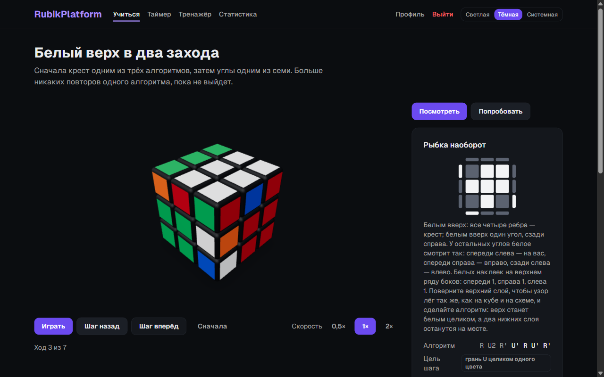
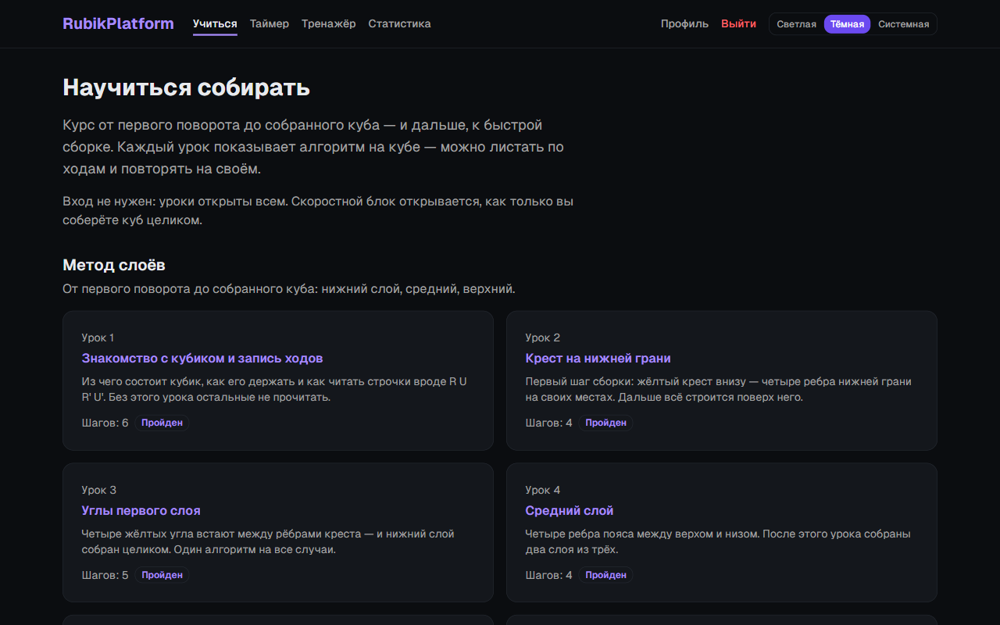
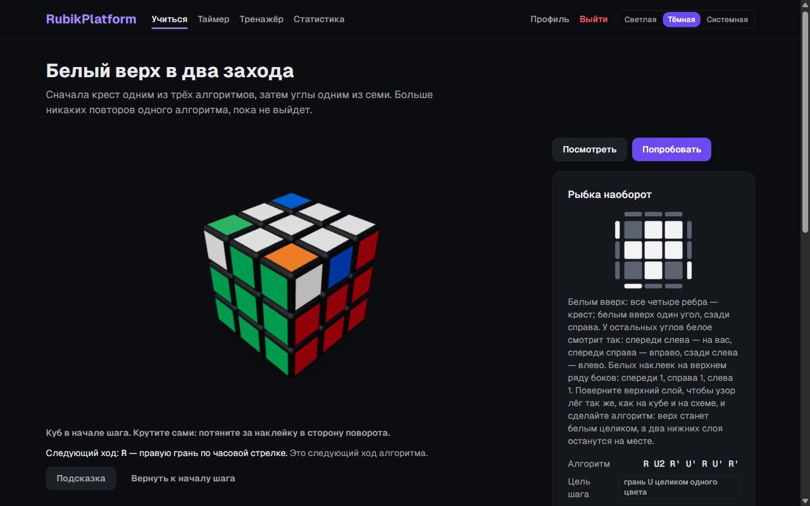
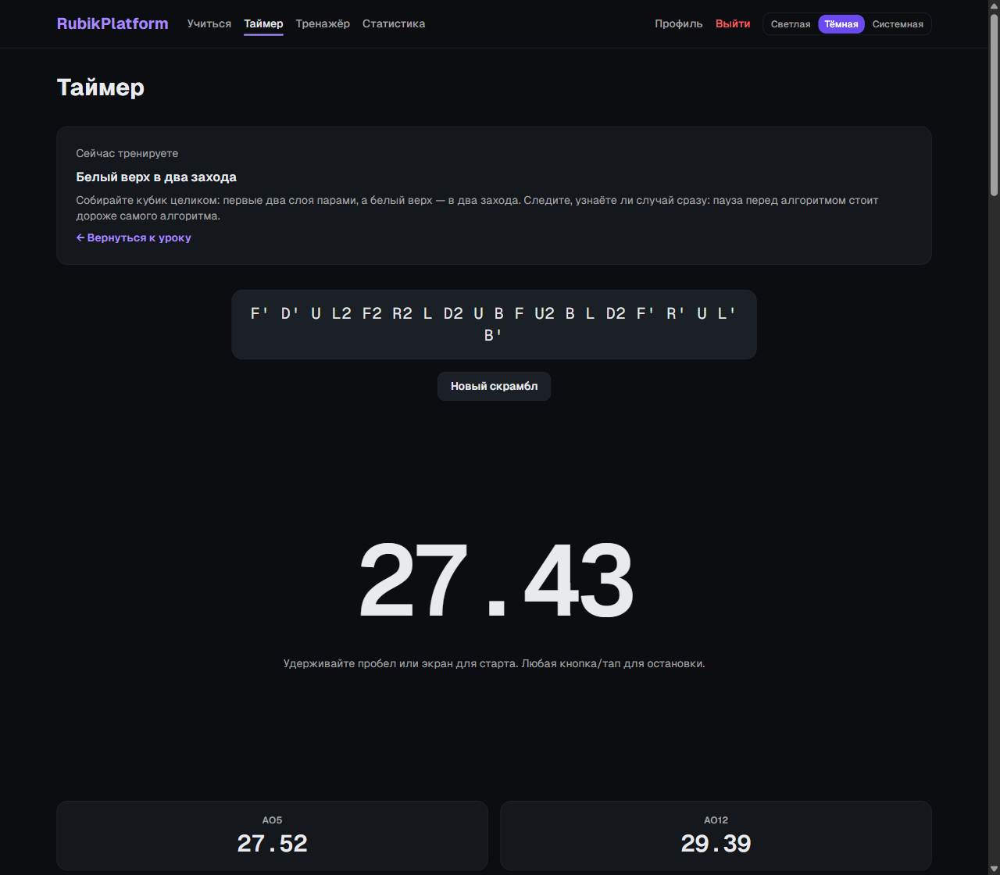
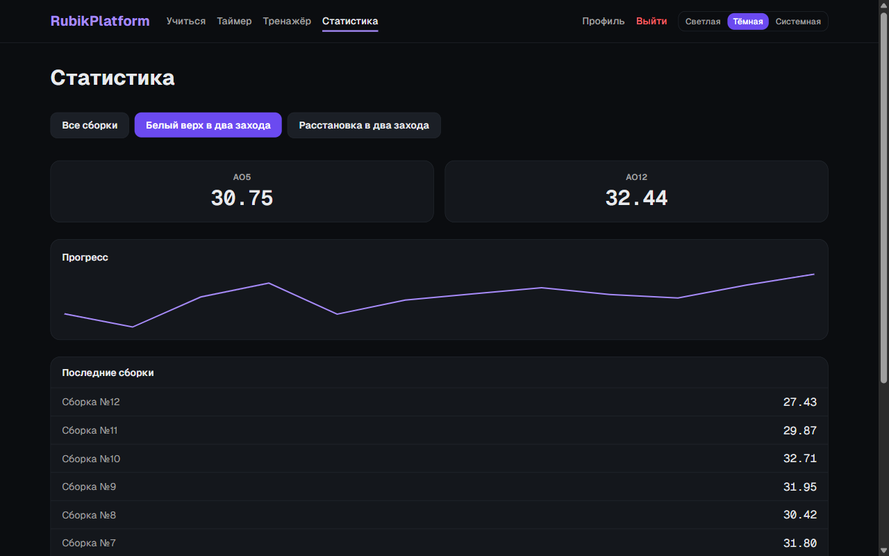
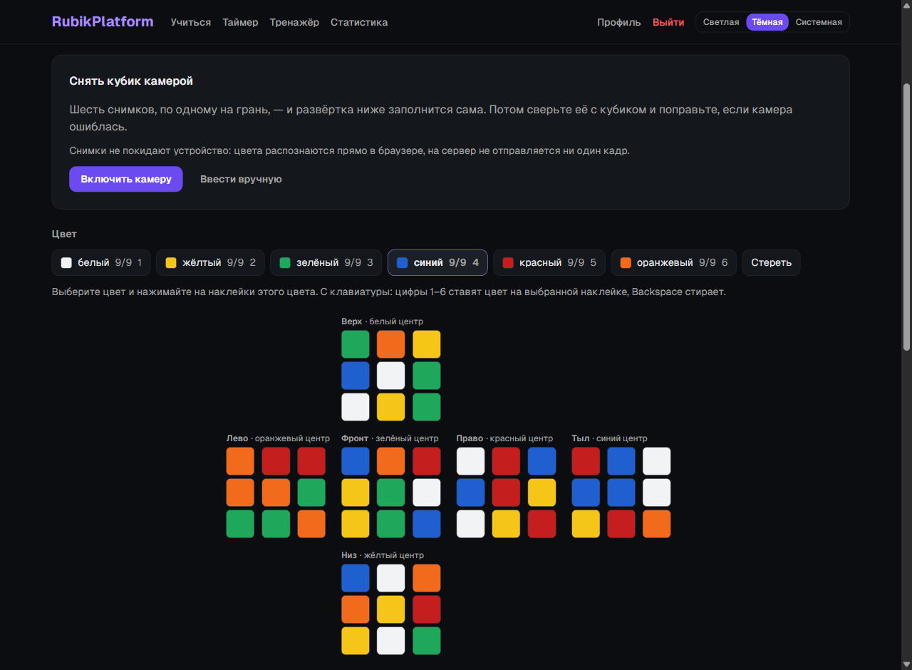
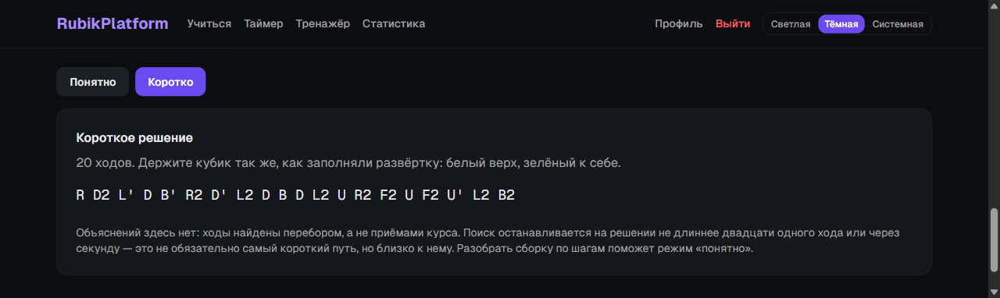
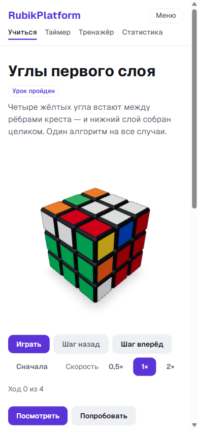
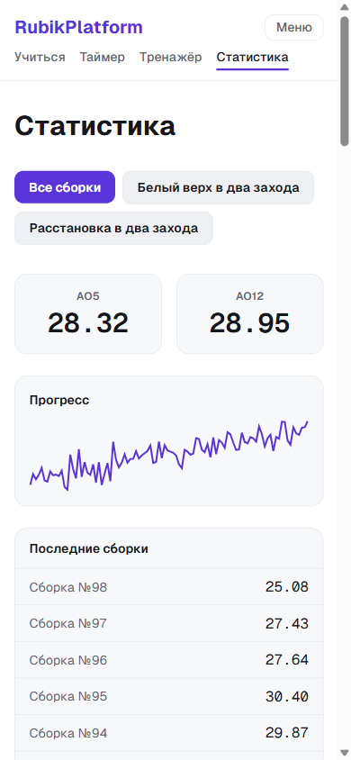

# Кубик Рубика: от первого поворота до скоростной сборки

Курс сборки кубика 3×3 в браузере: живой 3D-куб, уроки с проверкой каждого
хода, решатель для вашего кубика, таймер по правилам WCA и статистика
прогресса.

[](https://rubik-cube.miskevich.ru/)

[](https://github.com/pavelmiskevich/rubik-cube/actions/workflows/ci.yml)
[](https://github.com/pavelmiskevich/rubik-cube/actions/workflows/deploy.yml)
[](LICENSE)
[](https://nextjs.org/)
[](https://threejs.org/)
[](#проверка)
[](https://pay.cloudtips.ru/p/9ddf6429)



<sub>Урок скоростного блока. Слева — алгоритм, который куб проигрывает по ходу,
его можно листать вперёд и назад. Справа — схема случая: верх сверху и полоски
боковых наклеек, по которым случай узнают на своём кубике.</sub>

---

## О проекте

Платформа начиналась как тренажёр для тех, кто уже умеет собирать: скрамбл,
таймер, средние. Новичку на таком экране делать нечего — поэтому в центре
теперь курс. Он ведёт от записи ходов до собранного куба методом слоёв, а
затем дальше, к скоростному методу: первые два слоя парами, последний слой в
два захода и, наконец, за один алгоритм.

Уроки — это данные, а не картинки. Под курсом лежит движок состояния куба, и
каждый алгоритм каждого урока прогоняется через него тестом: доводит ли он
позицию до цели шага. Тот же движок проверяет ходы, которые человек делает
руками в режиме «Попробовать», решает кубик, раскраску которого перенесли на
развёртку, и отличает собираемый кубик от набора цветов, у которого решения
нет вовсе.

| | |
|---|---|
| **Уроков** | 16 в двух блоках: метод слоёв (7) и скоростной метод (9), всего 161 шаг |
| **Алгоритмов** | все 57 случаев ориентации и 21 перестановки последнего слоя; что наборы полные и без дублей, доказывает перебор всех 216 и 288 раскладов, а не глаз |
| **Проверка хода** | в режиме «Попробовать» шаг засчитывается, только если цель достигнута тем алгоритмом, которому он учит; подсказка — следующий ход |
| **Решатель** | послойный — шагами курса, около 150 ходов; короткий — двухфазный поиск, около 20 ходов за доли секунды, в фоновом потоке |
| **Ввод кубика** | развёртка вручную или камерой: шесть снимков, цвета распознаются в браузере, на сервер не уходит ни один кадр |
| **Таймер** | скрамблы по правилам WCA, старт по отпусканию пробела, во время замера экран пустеет |
| **Средние** | Ao5 и Ao12 по регламенту WCA: отбрасываются лучшая и худшая, штраф +2, DNF, округление до сотых |
| **Статистика** | средние, спарклайн прогресса, отдельно по каждому тренируемому уроку |
| **Без входа** | курс, решатель и таймер работают; вход нужен, чтобы сохранять сборки и прогресс — пройденное до входа переносится в аккаунт |
| **Оформление** | светлая, тёмная и системная темы; вёрстка под телефон |

## Что внутри



Курс открыт всем. Скоростной блок открывается, когда пройден последний урок
метода слоёв, — раньше в нём нечего делать. Прогресс хранится в браузере, а
после входа — в аккаунте.



В режиме «Попробовать» куб крутят сами — протаскиванием по наклейкам. Каждый
ход сверяется с движком: платформа знает, где вы на пути к цели шага, и по
запросу подсказывает следующий ход. Шаг, собранный другим путём, не
засчитывается — урок учит конкретному алгоритму.



Из урока можно уйти на таймер: он показывает, что сейчас тренируется, и
запоминает это вместе со сборкой. Средние пересчитываются после каждого замера.



Статистика — по всем сборкам или по одному уроку: видно, стал ли случай, который
гоняли неделю, собираться быстрее.



Раскраску своего кубика можно перенести на развёртку вручную или снять камерой.
Перед решением платформа проверяет, бывает ли такой кубик вообще, и если нет —
объясняет, что не так: цвета не по девять, деталь, которой у кубика нет, одна
и та же деталь дважды, повёрнутый на месте угол или перевёрнутое ребро.



Решение по умолчанию — шагами курса, со ссылкой на урок у каждого шага: длинное,
зато каждый шаг понятен. Кто собирать уже умеет, переключается на «коротко».

<p align="center">
  
  &nbsp;&nbsp;
  
</p>

<p align="center"><sub>На телефоне, светлая тема. Вход и выбор темы — под кнопкой «Меню», разделы — на виду.</sub></p>

## Запуск

Нужен Node 20.

```bash
npm install
npm run dev
```

Платформа поднимется на http://localhost:3000. Курс, решатель, таймер и 3D-куб
работают без базы; без неё не работают только вход и сохранение.

Со своей базой — в Docker:

1. Скопируйте `.env.example` в `.env` и заполните:
   - `AUTH_SECRET` — сгенерируйте: `openssl rand -base64 32`
   - `POSTGRES_USER`, `POSTGRES_PASSWORD`, `POSTGRES_DB` — по ним инициализируется база
   - `DATABASE_URL` — **с хостом `db`**, а не `localhost`: внутри compose-сети база доступна по имени сервиса
2. `docker compose up -d --build`
3. Откройте http://localhost:3030. Миграции применяет отдельный сервис `migrate`.

Для разработки со своей базой — поднять только её, с портом на `127.0.0.1:5432`:
`docker compose -f docker-compose.yml -f docker-compose.dev.yml up -d db`, в `.env`
указать `DATABASE_URL` с хостом `127.0.0.1` и выполнить `npx prisma migrate dev`.

| Переменная | Назначение |
|---|---|
| `AUTH_SECRET` | Ключ подписи сессий |
| `AUTH_URL` | Базовый адрес приложения. **Обязателен за прокси:** без него Auth.js не доверяет заголовку `Host`, и маршруты `/api/auth/*` отвечают ошибкой |
| `AUTH_GOOGLE_ID`, `AUTH_GOOGLE_SECRET` | Вход через Google — необязательно |
| `DATABASE_URL` | Строка подключения к PostgreSQL |
| `POSTGRES_USER`, `POSTGRES_PASSWORD`, `POSTGRES_DB` | Инициализация базы в Docker |
| `HOST_PORT` | Порт локального стека, по умолчанию `3030` |

Готовая платформа — на [rubik-cube.miskevich.ru](https://rubik-cube.miskevich.ru/);
как она туда попадает, описано в [deploy/README.md](deploy/README.md).

## Как это устроено

**Движок куба** — `src/lib/cube/`. Состояние — восемь углов и двенадцать рёбер
с ориентациями, а не 54 цветных квадрата: так ход — это перестановка, а
«собрано ли» — сравнение. Поверх него `predicates.ts` отвечает на вопросы
уроков («стоит ли крест», «собран ли первый слой»), `facelets.ts` переводит
раскраску в состояние и проверяет собираемость, `frames.ts` поворачивает не
кубик, а алгоритм — движок не знает поворотов всего куба, а курсу они нужны.

**3D-куб** — three.js через `@react-three/fiber`. Мост `bridge.ts` связывает ход
движка с поворотом среза на экране и обратно: урок проигрывает алгоритм
кубом, а жест человека приходит в урок ходом.

**Уроки** — типизированные модули в `src/content/lessons/`. У каждого шага есть
исходная позиция, алгоритм и цель — предикат движка. Тест прогоняет каждый
алгоритм и требует, чтобы цель была достигнута; правила из объяснений
проверяются перебором всех раскладов, а не примерами.

**Решатели.** Послойный (`solver.ts`) собирает кубик теми же приёмами, что и
курс, и называет шаги именами уроков. Короткий (`shortSolver.ts`) — двухфазный
поиск: сначала к подгруппе, где ориентированы все детали, затем внутри неё.
Таблицы для него строятся в браузере в фоновом потоке — меньше секунды при
первом выборе «коротко» — и в бандл страницы не попадают.

**Распознавание цвета** — `src/components/solve/camera/`. Из цвета убирается
яркость, эталоны — центры граней при том же свете, а наклейки раздаются по
девять на цвет разом, с наименьшей суммой расстояний. Спорная наклейка
отмечается пунктиром, а ошибку, которую пропустила камера, ловит проверка
собираемости.

**Средние** — `src/lib/statistics.ts`, по регламенту WCA, закреплены тестами.

## Проверка

```bash
npm test               # 2462 юнит- и компонентных теста в 50 наборах
npm run test:e2e       # сквозные сценарии без базы, поверх dev-сервера
npm run test:e2e:db    # приёмочный сценарий с базой (нужен DATABASE_URL)
npm run lint
npx tsc --noEmit
```

Юнит-тесты проверяют то, у чего есть правильный ответ: каждый алгоритм курса —
движком; полноту наборов — перебором; короткий решатель — на сотне скрамблов,
длиной и временем; распознавание цвета — на образцах пикселей под тёплой лампой
и в тени; средние — на случаях из регламента; вход и регистрацию — на защитных свойствах: фиктивный хеш для несуществующего адреса, одинаковый ответ на занятый email, окно лимита попыток.

Компонентные тесты (jsdom и Testing Library, окружение включается пофайлово) проверяют поведение экранов: машину состояний таймера и то, что сборка сохраняется со скрамблом, бывшим на экране, меню шапки, фильтр статистики, раскраску развёртки, режим «Попробовать» с подменой 3D-куба.

Приёмочный сценарий идёт на настоящем Postgres: пройти урок без входа, зарегистрироваться, войти — прогресс переехал; пять сборок на таймере — Ao5 на `/stats` совпадает с расчётом по базе; сборка из урока помечена уроком; повторный вход ничего не задваивает.

**Git-хуки:** `pre-commit` — gitleaks по изменениям, ESLint и проверка типов;
`pre-push` — gitleaks по всей истории. Gitleaks работает в Docker: без него не
пройдут ни коммит, ни пуш.

**CI:** на каждом PR в `main` три обязательные проверки — `audit`
(`audit-ci --high`, без исключений), `build` (линт, типы, юнит-тесты, сборка и
проверка всего Docker-стека) и `e2e` (оба набора Cypress на production-сборке
с Postgres в service-контейнере).

## Разработка

Открыто, через [задачи](https://github.com/pavelmiskevich/rubik-cube/issues):
у каждой метки раздела, размера и приоритета, крупное собрано в эпики. Ветка
`feature/issue-N-кратко` → PR в `main` → merge-коммит.

- [STATE.md](STATE.md) — что сделано и где лежит, грабли окружения
- [TECHDEBT.md](TECHDEBT.md) — принятые решения и отложенный долг
- [docs/superpowers/specs/](docs/superpowers/specs/) — согласованные проектные решения

```
src/
  app/          маршруты: курс, урок, таймер, тренажёр, статистика, решатель
  actions/      серверные действия: вход, сборки, прогресс
  components/
    cube/       3D-куб и логика жестов
    learn/      проигрыватель урока, «Попробовать», прогресс
    solve/      развёртка, решение, камера
    timer/      таймер и рабочий экран
    dashboard/  статистика
  content/
    lessons/    уроки курса и их тесты
  lib/
    cube/       движок, предикаты, решатели
prisma/         схема и миграции
deploy/         выкладка на сервер
cypress/        сквозные сценарии
```

---

## Поддержать автора

Понравилась платформа? Буду благодарен за любую поддержку — она идёт на развитие
проекта.

<a href="https://pay.cloudtips.ru/p/9ddf6429">
  
</a>

Оплата в один клик через **СБП**, **T-Pay**, **SberPay** или банковские карты.

---

## Лицензия

Код распространяется по лицензии [MIT](LICENSE).
